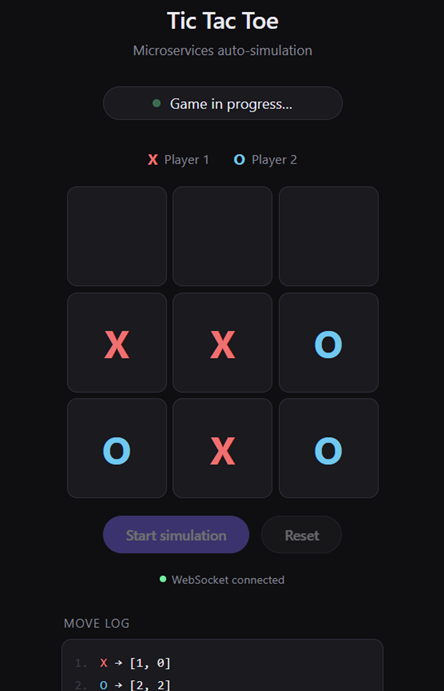

# Distributed Tic Tac Toe — Microservices

A Tic Tac Toe game that plays itself: one backend service automates the moves
for both players while another enforces the game rules, with a browser UI that
watches the game unfold live.



## Architecture

```
                          ┌──────────────┐
                          │ Eureka Server│  (service registry, :8761)
                          └──────▲───────┘
                                 │ register / discover
              ┌──────────────────┼──────────────────┐
              │                  │                  │
     ┌────────┴───────┐  ┌───────┴────────┐  ┌───────┴────────┐
     │    Gateway     │  │ Session Service│  │  Game Engine   │
     │     :8080      │──▶     :8082      │──▶     :8081      │
     │ (single public │  │ (sessions,     │  │ (board state,  │
     │  entry point)  │  │  simulation)   │  │  move rules)   │
     └────────▲───────┘  └───────┬────────┘  └────────────────┘
              │                  │ H2 (in-memory)
        browser (index.html)     ▼
        REST + WebSocket    sessions / moves tables
```

- **Game Engine** (`game-engine`) — owns board state, validates moves, and
  detects win/draw. State lives in a `ConcurrentHashMap` (per the assignment's
  "in-memory data structure" option);
- **Session Service** (`session-service`) — creates sessions, automates play
  for both sides by calling the Game Engine, and persists sessions/moves to
  an in-memory H2 database. The move loop and HTTP layer are fully reactive
  (WebFlux + `WebClient`); JPA access is isolated behind
  `SessionPersistenceService` and shifted onto a bounded-elastic scheduler so
  it never blocks the event loop. Live progress is pushed to subscribers over
  a WebSocket (`/ws/sessions?sessionId=...`) — there is intentionally no
  reconnect/resume support, a dropped connection just stops that session's
  simulation.
- **Gateway** (`gateway`, Spring Cloud Gateway) — the single public entry
  point. Routes `/games/**` to Game Engine, `/sessions/**` and `/ws/**` to
  Session Service, and everything else (`/**`) to Session Service too, which
  is what serves `index.html`.
- **Eureka Server** (`eureka-server`) — service registry every other service
  registers with and discovers peers through, standing in for a production
  service mesh.

## Technology Stack

### Backend Services

- **Java 25** with **Spring Boot 4.1.0**
- **Spring Cloud Gateway** for reactive routing
- **Spring WebFlux**
- **WebSocket**
- **Netflix Eureka** for service discovery

### Data Layer

- **H2** (in-memory)

## Requirements

- Docker with Compose v2 (the `docker compose` command) — all you need to
  build and run the stack; the images compile the jars themselves.
- JDK 25 — only needed to run the Gradle build/tests locally (`./gradlew ...`),
  not to run via Docker. Must be discoverable by Gradle (`JAVA_HOME` or `PATH`).

## Quick Start

All you need is Docker (with Compose v2) — the images build their own jars, so
no local JDK or Gradle is required:

```bash
docker compose up --build
```

Then open **http://localhost:8080** and click **Start simulation**. The board
updates live as the Session Service plays both sides; a move log and final
result (win/draw) appear alongside it.

Service ports (all published to the host for convenience/debugging):

| Service          | Port |
|------------------|------|
| Gateway          | 8080 |
| Game Engine      | 8081 |
| Session Service  | 8082 |
| Eureka Server    | 8761 |

## API

**Game Engine** (via gateway: `http://localhost:8080/games/...`)

| Endpoint                     | Success | Description                                    |
|-------------------------------|---------|------------------------------------------------|
| `POST /games/{gameId}`        | 201     | Create a game with an empty board              |
| `POST /games/{gameId}/move`   | 200     | Submit `{ "player": "X", "row": 0, "col": 0 }` |
| `GET /games/{gameId}`         | 200     | Current board and status                       |

**Session Service** (via gateway: `http://localhost:8080/sessions/...`)

| Endpoint                              | Success | Description                                           |
|---------------------------------------|---------|-------------------------------------------------------|
| `POST /sessions`                      | 201     | Create a session (backing game is created lazily on simulate) |
| `POST /sessions/{sessionId}/simulate` | 202     | Start automated play in the background                |
| `GET /sessions/{sessionId}`           | 200     | Session status + full move history                    |
| `WS /ws/sessions?sessionId=...`       | 101     | Live session snapshots as the simulation progresses   |

## Building & testing locally

Requires JDK 25 on the host. Full build — compile, run unit tests, and package
a bootable jar per service:

```bash
./gradlew build
```

**Unit and slice tests** (fast, no Docker required):

```bash
./gradlew test
```

Covers the Game Engine's board/move/win-detection domain logic
(`BoardTest`, `GameTest`), its service and web layers (`GameServiceTest`,
a `@WebMvcTest` for `GameController`), and Session Service's move generation
and session orchestration (`MoveGeneratorTest`, `SessionServiceTest`). The
reactive simulation loop and full inter-service wiring are intentionally left
to the end-to-end test below rather than re-mocked in isolation.

**End-to-end test** (builds and runs the whole stack via Testcontainers):

```bash
./gradlew :e2e-tests:test
```

`AutomatedGameE2ETest` brings up Eureka, Game Engine, Session Service and
Gateway from `e2e-tests/docker-compose.yaml`, then drives the stack exactly
the way `index.html` does: create a session through the gateway, subscribe to
its WebSocket feed, trigger the simulation, and assert the stream of session
snapshots ends in `WIN`, `DRAW`, or `ERROR`.

## Discussion / potential improvements

- **No authentication**: every endpoint is open. A real deployment would put
  authentication/authorization in front of the API (e.g. Spring Security with
  JWTs, enforced at the gateway), and secure the WebSocket handshake too.
- **State is lost on restart**: the Game Engine keeps games in a
  `ConcurrentHashMap` and the Session Service uses an in-memory H2 database, so
  everything is gone when a service restarts. Fine for a demo. For a
  production-grade deployment, swap H2 for PostgreSQL and use it for Game Engine too.
- **No circuit breaker around the Game Engine client**: `GameEngineClient`
  surfaces failures as `GameEngineCommunicationException` but doesn't back
  off or trip a breaker; Resilience4j would be the natural addition if the
  Game Engine became flaky under load.
- **No WebSocket reconnect/resume**: a dropped connection stops that
  session's simulation outright rather than letting the client resume it;
  fine for a demo, not for production.
- **Logging is console-only with default formatting**: each service logs to
  stdout via Spring Boot's default Logback setup. In production we would keep
  logs going to stdout but switch to structured JSON output via a `logback-spring.xml`,
  so a log aggregator (ELK, Loki, CloudWatch) can collect and query them across services.
- **SSE would be a simpler fit than WebSocket**: the browser only consumes
  updates and never sends a socket message, so the bidirectional channel is
  unused. WebSocket was chosen as the assignment allows it.

## Repository layout

```
game-engine/       Game Engine microservice
session-service/   Session Service microservice (+ static UI at src/main/resources/static/index.html)
gateway/           Spring Cloud Gateway
eureka-server/     Eureka service registry
e2e-tests/         Testcontainers-based end-to-end test
```
